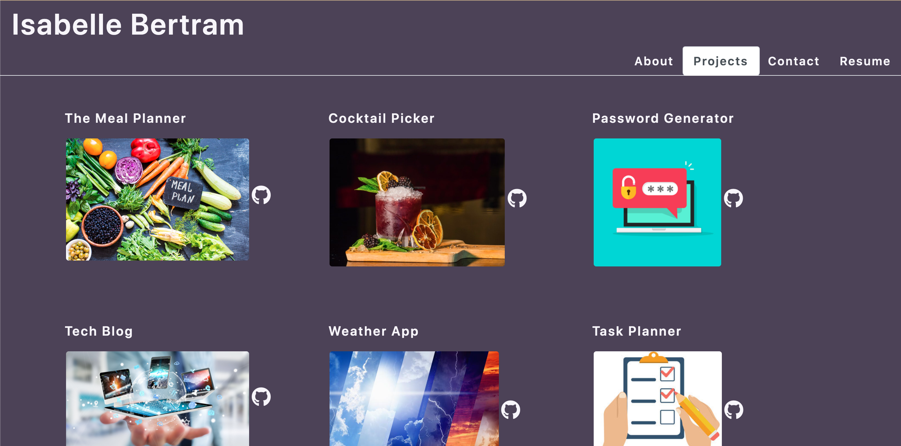

# react-portfolio
This repository contains the code for a developer's portfolio using React rather than pure HTML and CSS. 

## Description
This challenge was a "redo" of an earlier challenge that used solely HTML and CSS to create a portfoliio. Now we used React to create this portfolio with all the same components. 
This was a good introduction to using React and not having to manage many different HTML pages. 

## Additional Information
### Notes
The most difficult part about this project is figuring out how to display the images. The relative pathing doesn't quite work as expected. I think there is an option to put the images in the public folder but I went with importing the images directly into the Project.js and using the props.id. 

### Screenshot

### Access Application

* https://github.com/IsiBee/react-portfolio - Github Repo
* https://isibee.github.io/react-portfolio/ - Deployed App
